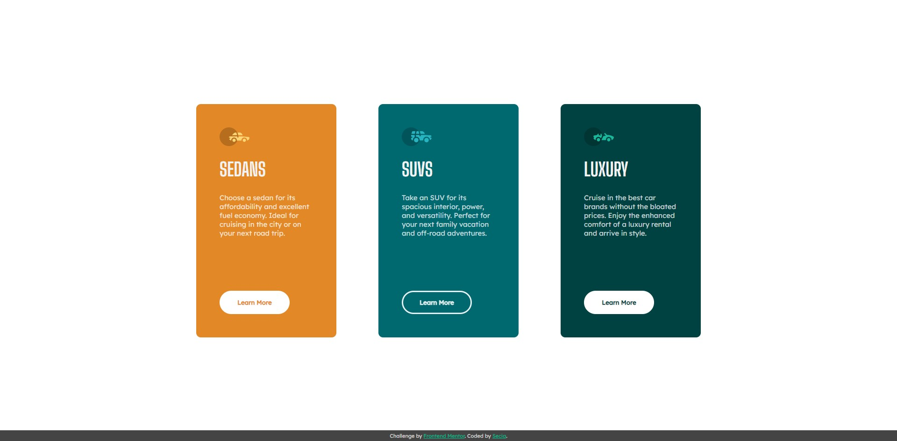

# 3-column preview card component solution

***

This project was build as a part of frontend classes conducted within the Information Technology Club [LearnIT](learnit.how).

***

### The challenge

The challenge is to provide a solution for the [3-column preview card component challenge on Frontend Mentor](https://www.frontendmentor.io/challenges/3column-preview-card-component-pH92eAR2-).

Users should be able to:

- View the optimal layout depending on their device's screen size
- See hover states for interactive elements

### Screenshot

### Used concepts

- Flexbox
- Position property
- Media queries

### Useful resources

- [A Complete Guide to Flexbox](https://css-tricks.com/snippets/css/a-guide-to-flexbox/)
- [Position - MDN Web Docs](https://developer.mozilla.org/en-US/docs/Web/CSS/position)
- [Learn CSS Position In 9 Minutes - Web Dev Simplified YT](https://www.youtube.com/watch?v=jx5jmI0UlXUposition)
- [A Complete Guide to CSS Media Queries](https://css-tricks.com/a-complete-guide-to-css-media-queries/)
